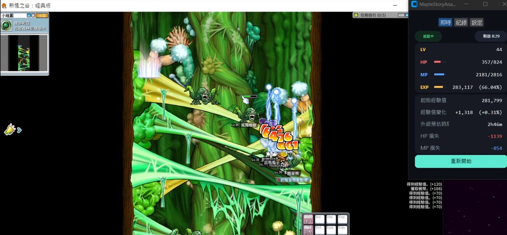

# MapleStoryAnalyer

*[繁體中文版 README](README.md)*

A small always-on-top HUD that watches your MapleStory game window and tracks
your HP, MP, EXP, and Level in real time. It uses OCR (optical character
recognition) to read the stat numbers straight off your screen — no typing,
no macros, no game files or memory access. Use it to see how much EXP/HP/MP
you're burning per grinding session, compare sessions, and get a rough ETA
to your next level.

Read-only: it only looks at your screen, it never clicks, types, or sends
anything to the game.



*(HUD shown in Chinese — switch to English any time in Settings.)*

▶️ **[Demo video](https://youtu.be/Joqzcg6g798)** — see it running live.

## Features

- **Live tracking** — LV/HP/MP/EXP update about twice a second, with a
  progress bar for each. A status pill shows Tracking/Idle, and a countdown
  chip shows how long is left in the current session.
- **Sessions** — stats reset on a timer (default 10 minutes, adjustable) so
  "EXP diff" always means "since this session started." Hit **Restart
  Session** any time to end the current one early and start fresh.
- **History** — every finished session becomes a card: start→end time, EXP
  gained (with %), HP/MP lost. Newest session is always at the top. Click a
  card's title to give it a custom name (e.g. "Ellinia Forest").
- **Settings**:
  - **Window scale** — shrink or grow the whole window with a +/− stepper.
  - **Always on top** — toggle whether the HUD stays above the game.
  - **Language** — switch between 中文 and English any time, instantly.
  - **Session interval** — how often a session auto-resets (1–60 min).
  - **Display toggles** — show/hide HP, MP, EXP, EXP%, and level-up ETA
    individually.
- **Level-up ETA** — once a session has a few seconds of data, estimates
  time-to-next-level from your current EXP rate.

## Requirements

- **Windows** — real screen capture needs a live Windows desktop; this
  won't run for real on macOS/Linux.
- MapleStory installed and running.

## Install

No Python or setup needed — just the `MapleStoryAnalyer` folder containing
`MapleStoryAnalyer.exe`. Put it wherever you like (e.g. `Desktop\MapleStoryAnalyer`)
and keep the folder intact — the .exe needs the files alongside it.

## Launch tutorial

1. Have MapleStory running and visible (doesn't need to be focused *before*
   you launch the HUD, just focused *while* it tracks — see Troubleshooting).
2. Double-click `MapleStoryAnalyer.exe`. Windows may show a SmartScreen
   warning on first run since it isn't code-signed — click **More info →
   Run anyway**.
3. A small window titled "MapleStoryAnalyer" opens, always on top, on the
   **Live** tab by default. If the game window is found and focused, LV/HP/MP/EXP
   should start filling in within a second or two.
4. Click into the game and play normally — the HUD keeps reading in the
   background. Switch to the **History** tab any time to see past sessions,
   or **Settings** to adjust scale, language, session length, etc.
5. Close the window like any other app when you're done — nothing needs to be
   shut down separately.

## Run with Python instead

Prefer running from source instead of the .exe? You'll need:

- **Python 3.10** (via the `py` launcher, e.g. `py -3.10`).
- MapleStory installed and running (same as above).

Open a terminal in this project's folder and run once:

```powershell
py -3.10 -m venv .venv
.venv\Scripts\pip install -r requirements.txt
.venv\Scripts\python .venv\Scripts\pywin32_postinstall.py -install
```

This creates a `.venv` folder with everything the app needs (OCR engine, UI
toolkit, screen-capture libraries). You only need to do this once; after
that, launch with:

```powershell
.venv\Scripts\python scripts\run_overlay.py
```

Same Launch tutorial and Troubleshooting apply either way — the app behaves
identically whether started via the .exe or this command.

## Troubleshooting

- **All fields show `--` / blank.** The game window isn't focused. This is a
  hard constraint, not a bug: the game itself dims its rendering when it
  loses focus, and that starves the OCR of readable text. Click back into
  the game window.
- **Status pill says "Game window not found."** The HUD looks for a window
  titled `新楓之谷` by default. If your client's window title is different,
  this won't match it.
- **Status pill says "Game window minimized."** Restore the game window (it
  doesn't need to be the foreground window once tracking has started again,
  just not minimized).
- **A field is occasionally wrong for one tick, then corrects itself.**
  OCR misreads happen — usually caused by a combat effect or floating damage
  number covering a stat bar for a frame. The HUD carries forward the last
  known good value instead of flashing blank, so a single bad tick shouldn't
  be visible.
- **Numbers look frozen / EXP not moving even though I'm playing.** Check the
  status pill — if it says "Tracking," data is flowing; if HP/MP/EXP truly
  haven't changed, that's genuinely idle (not a bug). If the pill shows an
  error instead, see the two bullets above.
- **Text is too small/cramped, or the window is an awkward size.** Settings
  → Window Scale, use the +/− stepper. There's also a scrollbar in Settings
  if some options are cut off at very small scales.
- **Want it to stop covering the game.** Settings → turn off "Always on top,"
  or just move/resize the window like any other.
- **Session numbers look "off" after clicking Restart quickly twice.** By
  design, a restart within 1 second of the previous one is ignored (avoids
  logging a meaningless 0-duration entry) — this is expected, not a bug.

